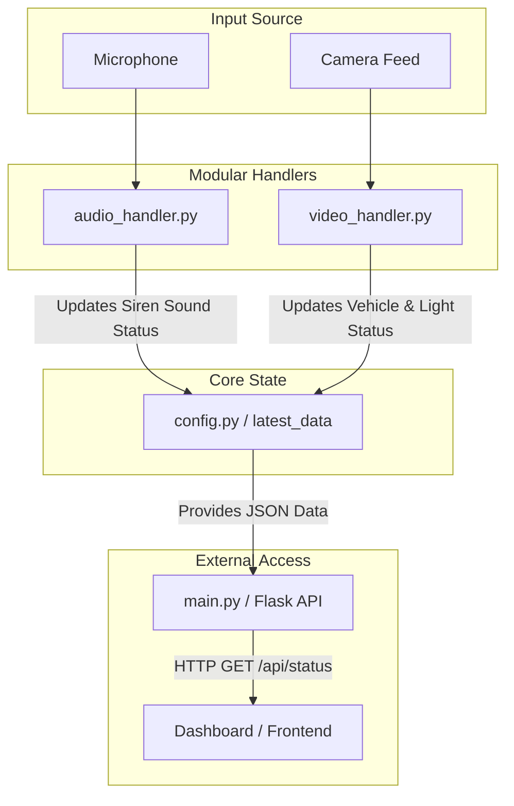

# Emergency Vehicle Detection System

A modular, real-time emergency vehicle detection system that combines audio siren analysis, visual vehicle identification (YOLOv8), siren light blinking detection (HSV), and OCR keyword extraction.

## System Architecture

The following diagram illustrates how the components interact via a centralized global state:



## Workflow Explanation

1.  **Audio Detection (`audio_handler.py`)**:
    *   Continuously captures audio via `sounddevice`.
    *   Uses **YAMNet** (Google) to classify sound events.
    *   Filters for `siren`, `ambulance`, `police`, and `fire engine`.
    *   Requires consistent detection over `TEMPORAL_FRAMES` to trigger an alert.

2.  **Visual Detection (`video_handler.py`)**:
    *   **Vehicle Identification**: Uses a custom trained **YOLOv8** model (`bestAllVehicle.pt`) to identify vehicle types.
    *   **OCR (Optical Character Recognition)**: Uses **EasyOCR** on detected vehicle crops to find keywords like "Ambulance", "Police", "Suwasariya", etc.
    *   **Light Detection (Night Mode)**: Pre-filters the crop for brightness, then applies HSL masks for RED, BLUE, and AMBER. It tracks blinking patterns to confirm emergency signals.

3.  **Day/Night Logic**:
    *   The system automatically switches between **Day** and **Night** modes based on system time (6 PM - 6 AM).
    *   In **Day**, logic focuses on Vehicle Type + OCR + Sound.
    *   In **Night**, logic prioritizes Siren Sound + Blinking Light patterns + OCR.

4.  **API Integration**:
    *   The `main.py` script runs a Flask server in a separate thread.
    *   The dashboard can poll `http://localhost:5000/api/status` to get a unified JSON object containing all current detection states.

## External Access

*   **JSON Data**: `http://localhost:5000/api/status` - Returns latest sensor and detection state.
*   **Live Video**: `http://localhost:5000/video_feed` - MJPEG stream of processed video with detection overlays.

## Project Structure

*   `main.py`: Entry point, thread orchestrator, and Flask server.
*   `config.py`: Centralized configuration, thresholds, and the shared thread-safe state.
*   `audio_handler.py`: All audio-related processing logic.
*   `video_handler.py`: All vision-related processing logic (YOLO, OCR, Lights).
*   `bestAllVehicle.pt`: The custom trained YOLOv8 model.

## How to Run

1.  **Install Dependencies**:
    ```bash
    pip install -r requirements.txt
    ```
2.  **Configure Camera**:
    Edit `config.py` and set `CAMERA_INDEX` to `0` or `1` depending on your setup.
3.  **Start the System**:
    ```bash
    python main.py
    ```
4.  **View Data**:
    Open `http://localhost:5000/api/status` in your browser.
